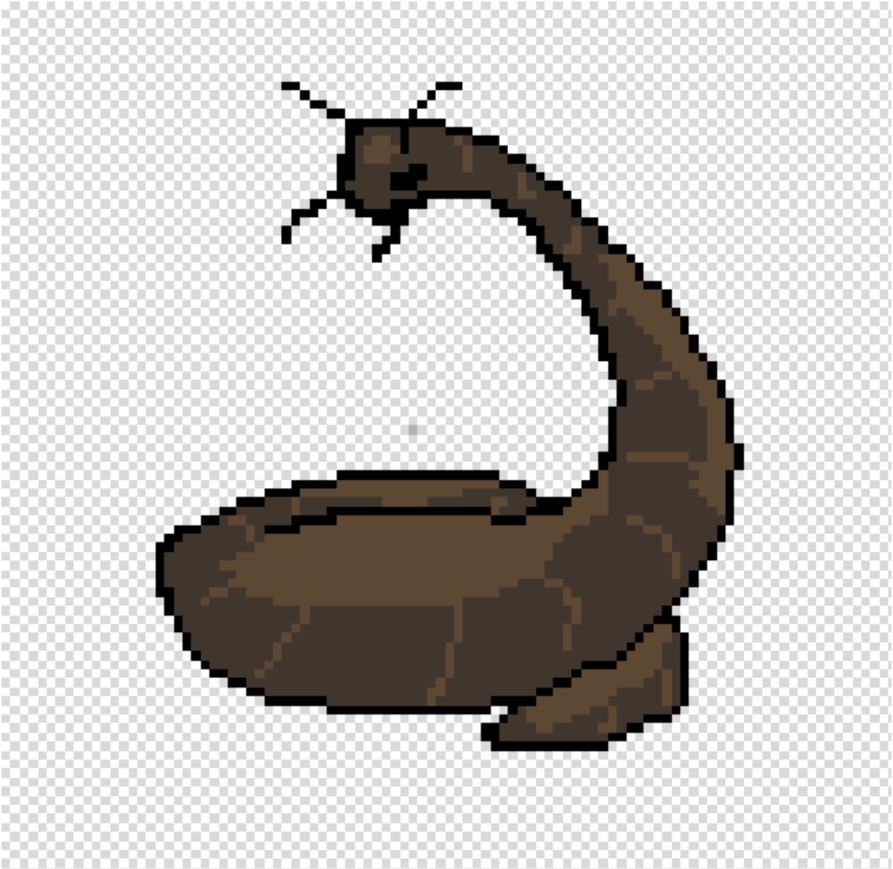
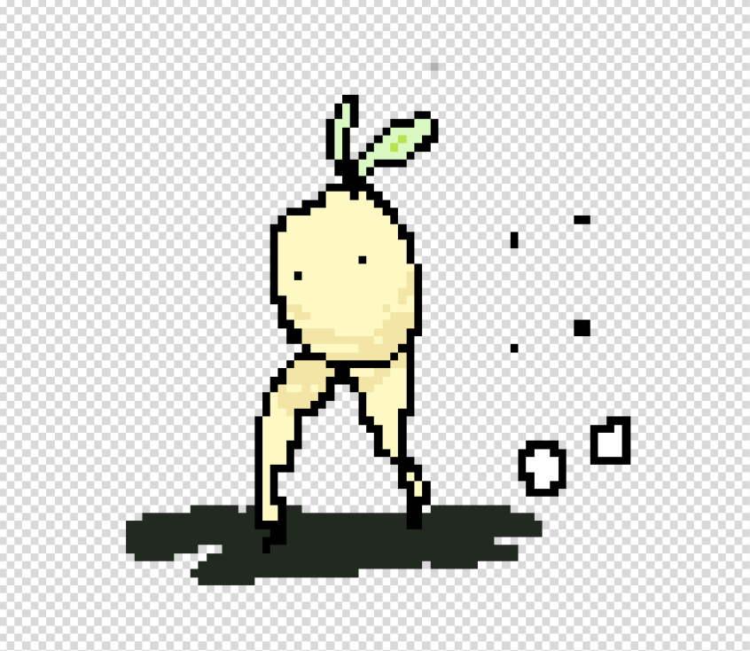
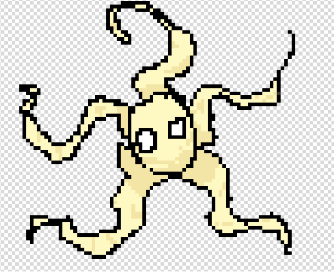
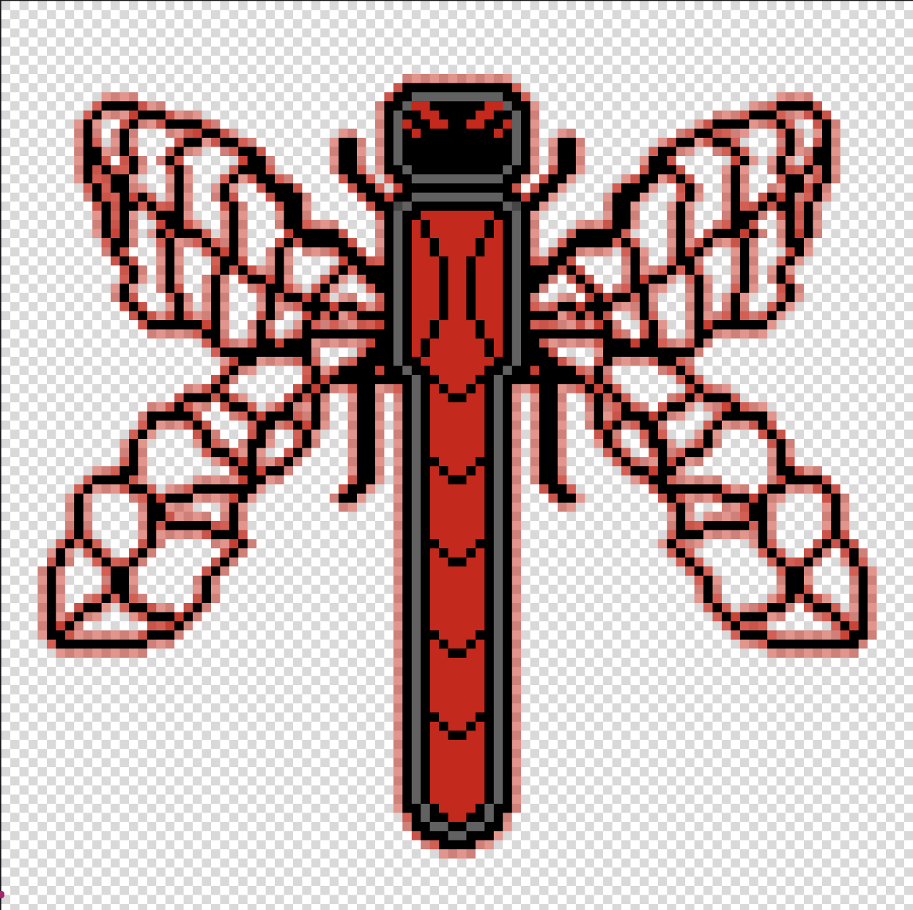

# Haustoria
game

‘Daikon game’ Haustoria Respiration Apparatus (Haustorium in Skotoperiod)

a kind of simple silly/cute 'horror' game, only scary in the sense that the artist will not willingly draw anything cute in a happy setting.

Necessary: 
Pygame
Vscode (python)
(maybe more so we can load my sprites)
(arjun, this is your part to make things compile and work together in the files)

Zak read here and below 
 |
 |
V

a simple little game where the main mechanics are:
- grabbing and throwing objects to progress and or fight (weapons)
- getting water & light (chlorophyll) (which deplete over time)
- gaining 'effects' which allow the player to fight
- simple combat (like hollow knight)
- movement tech **
- saving (like hollow knight benches)

Gameplay wise the player (daikon) has to navigate through generally dark regions and over time has to find water and light to survive while fighting enemies. If the light or water is fully depleted, then the player has to find an enemy (which later becomes the main survival tactic) to take water and light from or they die via psychosis.

Composed of 3 main parts:
Part one: overworld/garden, easiest level, rarely requires Haustoria, and enemies are very easy to kill, day-night cycle is short, and there are plenty of sources of light and water. Easy to no parkour and does not require much skill or movement tech. It is simple and meant as an introduction to the actual game.

Part two: underground/dirt tunnels, medium level, has some difficulty, bosses are introduced, and haustoria begins to become more of a used skill, enemies pose more of a threat and the day night cycle is substantially elongated (if not permanently night in some regions). Parkour is made more difficult, but is still doable with basic movement tech.

Part three: flesh tunnels, difficult level, bosses now do almost all the players HP haustoria is the only way to get chlorophyll and water, day night cycle is perma-night. Parkour requires advanced movement tech and hints are introduced when saving.

Main boss Dragonfly 2 times bigger than the burrowing worm 

Gameplay Mechanics: 
- Haustoria ability – an ability where the player attacks a NPC and plays a simple animation while sticking to the NPC and taking Chlorophyll and Water

- Objects on each level are available to pick up. The player must use some of these objects to progress by using them directly or to throw them as weapons to fight or use as platforms for movement on vertical surfaces.
- Water & Chlorophyll are the health of the player. They deplete over time. Chlorophyll is more scarce but completely replanishes health.
- The player gains effects from some plants which allow him to move faster or jump higher or do more damage than normal. Effects change the color or outline of the character to indicate they are active and last a limited amount of time.
- Simple combat (like hollow knight)
Using spears for close combat, or throwing spears for range combat.
Attacks can be parried if the player attacks while an enemy’s attack is at the edge of the player's hitbox (by a small range so it's not pixel perfect).
Rocks can also be thrown to stun.

- Movement: 
Wall-clinging and slowly slide down (like hollow knight)
Spear-bounce (Like hollow knight)
Wall climbing (side to side jumping when wall clinging to close enough walls)
Rolling (when falling from more than jump height. Keybinds would be downward movement (gravity) + ‘D/A’ or ‘left/right’)
Dash
Sliding (‘A/D’ + ‘S’ in succession or ‘left/right’ + ‘down’ in succession)
Jumping
Moving normally (ASWD / Arrow Keys)
Additional things like hitting walls causing small knockback allows for more movement tech like slide-wall-pounces

- saving (like hollow knight benches)

Gameplay wise the player (daikon) has to navigate through generally dark regions and over time has to find water and light to survive while fighting enemies. If the light or water is fully depleted, then the player has to find an enemy (which later becomes the main survival tactic) to take water and light from or they die via psychosis (effect).

Region day-night cycle depends on level, level 1 has day night cycle every 10 min for a full cycle of 6 min of day and 4 of night.
Level 2 has day-night in region 1 and 2, but not in 3. Day night lasts for 10 min, 3 min of day 7 of night.
Level 3 has no day night cycle. Instead, has a timer for every 5 min until more enemies spawn through ‘night’ spawns, but there is never a day time, just less spaws in the ‘day’.

PLAYER CONTROL SPEC — HAUSTORIA
1. Design Goals
Physics-driven interaction is primary
Movement is medium-floaty and forgiving
Combat is simple and non-precision
Resource survival is secondary pressure

2. Input Map
Movement
A / Left → Move left
D / Right → Move right
Space → Jump
S / Down → Down input
Up / W → Climb
Actions
E → Haustoria / Interact
F → Pick up / Drop
J → Attack / Throw
Movement Ability
Shift → Dash (ground only)

3. Core Physics
max_run_speed = 4.0
ground_acceleration = 0.45
ground_friction = 0.35

air_acceleration = 0.25
air_friction = 0.08

gravity = 0.32
max_fall_speed = 6.5

jump_velocity = -7.2

4. Jump System
Fixed jump height
Jump buffer: 0.1s
Coyote time: 0.1s
Wall bounce window:
wall_jump_window = 0.25s

5. States
IDLE, RUNNING, JUMPING, FALLING
WALL_CLINGING, WALL_BOUNCING, CLIMBING
DASHING, SLIDING, ROLLING
ATTACKING, USING_HAUSTORIA
STUNNED, DEAD

Modifier:
HOLDING_OBJECT

6. Wall Movement
Cling when airborne + touching wall + input toward wall
Slow slide: 1.5 speed
Manual wall jump only
Wall push force: 4.5

7. Dash
dash_speed = 7.5
dash_duration = 0.18
dash_cooldown = 0.5

Ground only
Disables gravity

8. Slide
slide_speed = 5.5
slide_duration = 0.35

Down + move
Reduces hitbox height

9. Roll
hard_landing_threshold = 6.0
roll_duration = 0.4

Triggered on hard landing + direction input

10. Object Interaction
Pickup:
F → grab nearest object

Throw:
J → throw (if holding)

throw_force_x = 8.0
throw_force_y = -1.5

11. Movement Tech
Spear bounce:
bounce_velocity = -8.0

Preserves horizontal momentum
Requires downward motion

12. Combat
Attack:
attack_duration = 0.2
attack_cooldown = 0.25

Direction:
attack_direction = movement_vector

Damage:
player_attack_damage = 1

13. Parry
Forgiving timing window (~0.1s)
Causes enemy stun + knockback

14. Haustoria
Activation:
press E near enemy
Effects:
drain resources from enemy
restore player water + chlorophyll
Locks player in place
Vulnerable state

15. AI Implementation Notes
All values must be constants for tuning
Use state machine + physics loop separation
Object physics must remain active when not held
Movement must not depend on combat system
Prioritize collision correctness over animation
Build systems in this order:
Movement
Collision
Object interaction
Combat
Haustoria
 

Each person's part:
Sam is the artist, in charge of making sprites, levels, etc. Zach is the coder in charge of making the code for the game, Arjun is responsible for file management, readme updates, and github commits.
