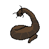

# Haustoria
game

‘Daikon game’ Haustoria Respiration Apparatus (Haustorium in Skotoperiod)

a kind of simple silly/cute 'horror' game, only scary in the sense that the artist will not willingly draw anything cute in a happy setting.

Necessary: 
Pygame
Vscode (python)
(maybe more so we can load my sprites)
(arjun, this is your part to make things compile and work together in the files)

Zak read here and below 
 |
 |
V

a simple little game where the main mechanics are:
- grabbing and throwing objects to progress and or fight (weapons)
- getting water & light (chlorophyll) (which deplete over time)
- gaining 'effects' which allow the player to fight
- simple combat (like hollow knight)
- movement tech **
- saving (like hollow knight benches)

Gameplay wise the player (daikon) has to navigate through generally dark regions and over time has to find water and light to survive while fighting enemies. If the light or water is fully depleted, then the player has to find an enemy (which later becomes the main survival tactic) to take water and light from or they die via psychosis.

Composed of 3 main parts:
Part one: overworld/garden, easiest level, rarely requires Haustoria, and enemies are very easy to kill, day-night cycle is short, and there are plenty of sources of light and water. Easy to no parkour and does not require much skill or movement tech. It is simple and meant as an introduction to the actual game.

Part two: underground/dirt tunnels, medium level, has some difficulty, bosses are introduced, and haustoria begins to become more of a used skill, enemies pose more of a threat and the day night cycle is substantially elongated (if not permanently night in some regions). Parkour is made more difficult, but is still doable with basic movement tech.

Part three: flesh tunnels, difficult level, bosses now do almost all the players HP haustoria is the only way to get chlorophyll and water, day night cycle is perma-night. Parkour requires advanced movement tech and hints are introduced when saving.

Main boss Dragonfly 2 times bigger than the burrowing worm 
